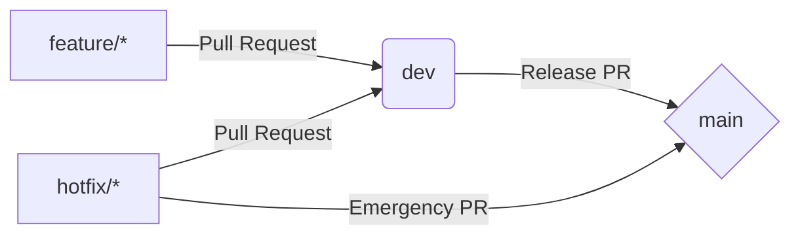

# 🌀 ExamAI – Git Workflow & Contribution Guide

This document defines the **official GitHub workflow** for the ExamAI project. All team members must follow this process to ensure stability, traceability, and smooth collaboration.

---

## 🏗️ 1. Branching Strategy

We utilize a **multi-branch, protected workflow** to maintain code integrity.

| Branch      | Purpose                             | Protection Level    |
| ----------- | ----------------------------------- | ------------------- |
| `main`      | **Stable / Production-ready code.** | 🛑 Highly Protected |
| `dev`       | **Integration & testing branch.**   | ⚠️ Protected        |
| `feature/*` | New features & enhancements.        | ✅ Open             |
| `hotfix/*`  | Critical bug fixes.                 | ✅ Open             |

### 🛠️ Branch Responsibilities

- **`main`**: Always stable. Represents the production state. No direct pushes allowed.
- **`dev`**: Integration branch for features under testing. No direct pushes allowed.
- **`feature/`**: Created from `dev`. Used for new functionality.
- **`hotfix/`**: Created from `main` or `dev`. Used for urgent fixes.

---

## 📈 2. High-Level Workflow Diagram



---

## 🚀 3. Creating a Feature Branch

Always start by syncing your local environment with the remote `dev` branch.

```bash
# Sync with remote
git checkout dev
git pull origin dev

# Create new feature branch
git checkout -b feature/your-feature-name

```

> **Example:** `git checkout -b feature/ocr-preprocessing`

---

## 📝 4. Development & Commits

### Step 1: Stage Changes

```bash
git add .

```

### Step 2: Commit with Style

We follow a simplified [Conventional Commits](https://www.conventionalcommits.org/) pattern:

| Prefix      | Description                                             | Example                               |
| ----------- | ------------------------------------------------------- | ------------------------------------- |
| `feat:`     | A new feature                                           | `feat: add grading rubric engine`     |
| `fix:`      | A bug fix                                               | `fix: handle empty OCR outputs`       |
| `docs:`     | Documentation changes                                   | `docs: update architecture overview`  |
| `refactor:` | Code change that neither fixes a bug nor adds a feature | `refactor: optimize image processing` |

```bash
git commit -m "feat: add OCR text cleaning pipeline"

```

---

## 📤 5. Pushing & Pull Requests (PR)

Push your branch to GitHub:

```bash
git push origin feature/your-feature-name

```

### 🔍 Pull Request Requirements:

1. **Base branch:** `dev` ← **Compare branch:** `feature/*`
2. **Approval:** At least **1 approval** from CODEOWNERS is required.
3. **Resolution:** All conversations and comments must be resolved.
4. **Checks:** Ensure all CI/CD pipelines (if any) are passing.

---

## 🧪 6. Merging & Cleanup

### Merging into `dev`

After approval, use **Squash and Merge** to keep a clean history.

### Post-Merge Cleanup:

```bash
# Delete local branch
git branch -d feature/your-feature-name

# Delete remote branch
git push origin --delete feature/your-feature-name

```

---

## 🚨 7. Hotfix Workflow (Critical Bugs)

If a critical bug exists in production that cannot wait for the next release:

1. Branch from `main`: `git checkout -b hotfix/bug-name main`
2. Fix the bug and PR back to `main`.
3. **Important:** Merge `main` back into `dev` immediately after to keep branches synced.

---

## 📜 8. Rules Summary

- ✅ **No direct pushes** to `main` or `dev`.
- ✅ **PRs are mandatory** for all changes.
- ✅ **Descriptive commit messages** are required.
- ✅ **Feature branches** must be deleted after merging.
- ✅ **Stay Updated:** Regularly pull from `dev` to avoid merge conflicts.

---

> **Note:** If you are unsure about any step, please ask in the team channel before pushing. This workflow ensures that **ExamAI** remains a high-quality, scalable product.
