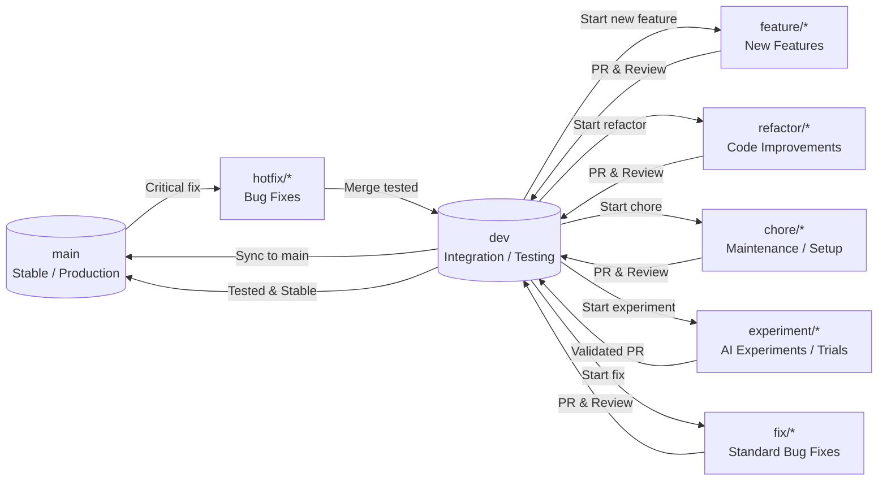

# 🌀 ExamAI – Git Workflow & Contribution Guide

This document defines the **official GitHub workflow** for the ExamAI project. All team members must follow this process to ensure stability, traceability, and smooth collaboration.

---

## 🏗️ 1. Branching Strategy

We utilize a **multi-branch, protected workflow** to maintain code integrity.

| Branch | Purpose | Protection Level |
| --- | --- | --- |
| `main` | **Stable / Production-ready code.** | 🛑 Highly Protected |
| `dev` | **Integration & testing branch.** | ⚠️ Protected |
| `feature/*` | New features & enhancements. | ✅ Open |
| `refactor/*` | Code improvements (no new logic/fixes). | ✅ Open |
| `fix/*` | Non-critical bug fixes (found during dev/testing). | ✅ Open |
| `hotfix/*` | Critical bug fixes starting from `main`. | ✅ Open |
| `chore/*` | Maintenance, configuration, or setup tasks. | ✅ Open |
| `experiment/*` | AI trials, research, and experimental code. | ✅ Open |

### 🛠️ Branch Responsibilities

* **`main`**: Always stable. Represents the production state.
* **`dev`**: The "Work-in-Progress" hub. All work branches merge here first.
* **`feature/`**: Development of new functionality.
* **`refactor/`**: Cleaning code or optimizing without changing behavior.
* **`fix/`**: Normal bug fixes found in the `dev` environment.
* **`hotfix/`**: Urgent fixes for bugs found in `main` (Production).
* **`chore/`**: Updating dependencies, CI/CD configs, or project boilerplate.
* **`experiment/`**: Testing new AI models or logic.

---

## 📈 2. High-Level Workflow Diagram



---

## 🚀 3. Starting Your Work

Always start by syncing your local environment with the remote `dev` branch.

```bash
# 1. Sync with remote
git checkout dev
git pull origin dev

# 2. Create your branch (pick the right prefix)
git checkout -b feature/your-task-name
# OR
git checkout -b fix/resolve-api-error

```

---

## 📝 4. Development & Commits

### Step 1: Stage Changes

```bash
git add .

```

### Step 2: Commit with Style

We follow [Conventional Commits](https://www.conventionalcommits.org/):

| Prefix | Use Case | Example |
| --- | --- | --- |
| `feat:` | A new feature | `feat: add AI grading logic` |
| `fix:` | A bug fix | `fix: resolve OCR timeout` |
| `refactor:` | Code change (not fix/feature) | `refactor: simplify loops` |
| `chore:` | Maintenance/Setup | `chore: update docker-compose` |
| `docs:` | Documentation updates | `docs: update setup guide` |
| `test:` | Adding/Updating tests | `test: add OCR unit tests` |

```bash
git commit -m "fix: resolve incorrect grading weight"

```

---

## 📤 5. Pushing & Pull Requests (PR)

```bash
git push origin <your-branch-type>/<name>

```

### 🔍 Pull Request (PR) Requirements:

1. **Base branch:** Always `dev`.
2. **Review:** At least **1 approval** is mandatory.
3. **Checks:** No PR will be merged if the build/tests fail.

---

## 🧪 6. Merging & Cleanup

### Merging Policy

* We use **Squash and Merge** to keep a clean history.

### Cleanup:

```bash
# After merge, delete locally
# 1️⃣ Switch back to dev and sync
git checkout dev
git pull origin dev

# 2️⃣ Delete local branch
git branch -d your-branch-name

# 3️⃣ Delete remote branch from GitHub
git push origin --delete your-branch-name

```

---

## 🚨 7. Special Workflows

### 🚑 Hotfix Workflow (Based on Diagram)

1. **Source:** Branch from `main` (`git checkout -b hotfix/fix-name main`).
2. **Fix:** Apply fix and commit.
3. **Validation:** Merge into `dev` first for testing.
4. **Production:** Once tested in `dev`, it is synced back to `main` via a Release PR.

### 🧪 Experiment Workflow

* Experiments that fail should be deleted without merging.
* Only **Validated Experiments** get a PR to `dev`.

---

## 📜 8. Final Rules

* ❌ **Never push directly** to `main` or `dev`.
* ❌ **No large PRs**: Keep them focused and small.
* ✅ **Sync often**: Pull from `dev` daily to avoid conflicts.

---

> **Pro Tip:** Use `git status` frequently to know exactly where you are. 🚀
