This is a solid workflow! To make it "GitHub-ready," I’ve polished the formatting using clean Markdown structures, enhanced the visual hierarchy, and converted your Mermaid diagram logic into a professional, scannable `README.md` or `CONTRIBUTING.md` format.

---

# 🌀 ExamAI – Git Workflow & Contribution Guide

This document defines the official GitHub workflow for the **ExamAI** project. All team members must follow this process to ensure code stability, traceability, and seamless collaboration.

## 🏗️ 1. Branching Strategy

We utilize a multi-branch, protected workflow to maintain code integrity.

| Branch         | Purpose                                            | Protection Level        |
| -------------- | -------------------------------------------------- | ----------------------- |
| `main`         | Stable / Production-ready code.                    | 🛑 **Highly Protected** |
| `dev`          | Integration & testing branch.                      | ⚠️ **Protected**        |
| `feature/*`    | New features & enhancements.                       | ✅ Open                 |
| `refactor/*`   | Code improvements (no new logic/fixes).            | ✅ Open                 |
| `fix/*`        | Non-critical bug fixes (found during dev/testing). | ✅ Open                 |
| `hotfix/*`     | Critical bug fixes starting from `main`.           | ✅ Open                 |
| `chore/*`      | Maintenance, configuration, or setup tasks.        | ✅ Open                 |
| `experiment/*` | AI trials, research, and experimental code.        | ✅ Open                 |

> [!IMPORTANT]
> All branches except `main` and `dev` are **temporary**. They should be created when needed and **deleted immediately** after a successful merge.

---

## 📈 2. Workflow Visualization

The diagram below illustrates how work flows between environments:

```mermaid
graph TD
    %% Core branches
    Main[(main<br>Stable<br/>🛑 Highly Protected)]
    Dev[(dev<br>Integration & Testing<br/>⚠️ Protected)]

    %% Middle Blocks (The Pull Logic)
    PullDev1[[Pull from dev for adding a feature]]
    PullDev2[[Pull from dev for fixing a bug]]
    PullDevMain[[Pull from main for critical bug fixing]]

    %% Work branches
    Feature[feature/*<br/>New features<br/>✅ Open]
    Fix[fix/*<br/>Non-critical bug fixes<br/>✅ Open]
    Hotfix[hotfix/*<br/>Critical fixes<br/>✅ Open]

    %% Pull rules
    PullMain[[Pull from main<br/>Testing, demo, showcase]]

    %% Core flow
    Main --> PullDevMain
    PullDevMain --> Hotfix
    Dev -->|Pull Request| Main

    %% Development flows
    Dev --> PullDev1
    PullDev1 --> Feature
    Feature -->|Pull Request| Dev

    Dev --> PullDev2
    PullDev2 --> Fix
    Fix -->|Pull Request| Dev

    Hotfix -->|Pull Request| Dev

    %% Pull arrows positioning
    Main -.-> PullMain

    %% Styles for Nodes
    style Main fill:#2c3e50,stroke:#000,stroke-width:2px,color:#ffffff
    style Dev fill:#34495e,stroke:#000,stroke-width:2px,color:#ffffff
    style Feature fill:#1f618d,stroke:#000,stroke-width:1px,color:#ffffff
    style Fix fill:#1f618d,stroke:#000,stroke-width:1px,color:#ffffff
    style Hotfix fill:#1f618d,stroke:#000,stroke-width:1px,color:#ffffff
    style PullMain fill:#7f8c8d,stroke:#000,stroke-width:1px,stroke-dasharray: 5 5,color:#ffffff
    style PullDev1 fill:#7f8c8d,stroke:#000,stroke-width:1px,color:#ffffff
    style PullDev2 fill:#7f8c8d,stroke:#000,stroke-width:1px,color:#ffffff
    style PullDevMain fill:#7f8c8d,stroke:#000,stroke-width:1px,color:#ffffff

    %% Link Styles (Unified to 4px)
    linkStyle 0,1,2,3,4,5,6,7,8,9,10 stroke-width:4px;
```



---

## 🚀 3. Starting Your Work

Always sync your local environment with the remote `dev` branch before starting.

```bash
# 1. Sync with remote
git checkout dev
git pull origin dev

# 2. Create your branch (pick the right prefix)
git checkout -b feature/your-task-name
# OR
git checkout -b fix/resolve-api-error

```

---

## 📝 4. Development & Commits

### Step 1: Stage Changes

```bash
git add .

```

### Step 2: Commit with Style

We follow the **Conventional Commits** specification:

| Prefix      | Use Case                              | Example                        |
| ----------- | ------------------------------------- | ------------------------------ |
| `feat:`     | A new feature                         | `feat: add AI grading logic`   |
| `fix:`      | A bug fix                             | `fix: resolve OCR timeout`     |
| `refactor:` | Code change (neither fix nor feature) | `refactor: simplify loops`     |
| `chore:`    | Maintenance/Setup                     | `chore: update docker-compose` |
| `docs:`     | Documentation updates                 | `docs: update setup guide`     |
| `test:`     | Adding/Updating tests                 | `test: add OCR unit tests`     |

---

## 📤 5. Pushing & Pull Requests (PR)

```bash
git push origin <your-branch-type>/<name>

```

### 🔍 Pull Request Requirements:

- **Base branch:** Always target `dev`.
- **Review:** PRs require approval from the branch owner or designated code owner.
- **Checks:** CI/CD pipelines must pass (builds/tests) before merging.

---

## 🧪 6. Merging & Cleanup

### Merging Policy

We use **Squash and Merge** to maintain a clean, linear project history.

### Remote & Local Cleanup

After your PR is merged, clean up your workspace:

```bash
# After merge, delete locally
# 1️⃣ Switch back to dev and sync
git checkout dev
git pull origin dev

# 2️⃣ Delete local branch
git branch -d your-branch-name

# 3️⃣ Delete remote branch from GitHub
git push origin --delete your-branch-name

```

---

## 🚨 7. Special Workflows

### 🚑 Hotfix Workflow

1. **Source:** Branch directly from `main`: `git checkout -b hotfix/fix-name main`.
2. **Validation:** Merge into `dev` first to ensure no regressions.
3. **Production:** Once verified in `dev`, it is synced back to `main` via a Release PR.

### 🧪 Experiment Workflow

- Experiments that fail should be **deleted** without merging.
- Only **validated** experiments that prove value receive a PR to `dev`.

---

## 📜 8. Final Rules

- ❌ **Never** push directly to `main` or `dev`.
- ❌ **No Large PRs:** Keep changesets focused and small for easier reviews.
- ✅ **Sync Often:** Pull from `dev` daily to minimize merge conflicts.

**Pro Tip:** Use `git status` frequently. If things get messy, ask for help before force-pushing! 🚀

---

**Would you like me to generate a `pull_request_template.md` to go along with this guide?**
