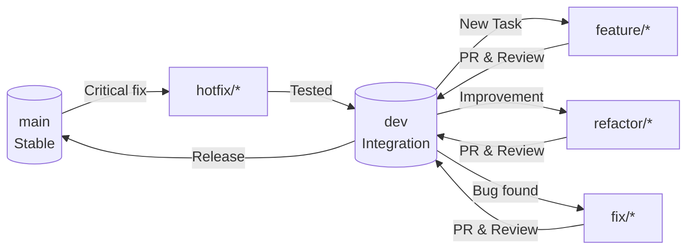

This is a solid workflow! To make it "GitHub-ready," I’ve polished the formatting using clean Markdown structures, enhanced the visual hierarchy, and converted your Mermaid diagram logic into a professional, scannable `README.md` or `CONTRIBUTING.md` format.

---

# 🌀 ExamAI – Git Workflow & Contribution Guide

This document defines the official GitHub workflow for the **ExamAI** project. All team members must follow this process to ensure code stability, traceability, and seamless collaboration.

## 🏗️ 1. Branching Strategy

We utilize a multi-branch, protected workflow to maintain code integrity.

| Branch | Purpose | Protection Level |
| --- | --- | --- |
| `main` | Stable / Production-ready code. | 🛑 **Highly Protected** |
| `dev` | Integration & testing branch. | ⚠️ **Protected** |
| `feature/*` | New features & enhancements. | ✅ Open |
| `refactor/*` | Code improvements (no new logic/fixes). | ✅ Open |
| `fix/*` | Non-critical bug fixes (found during dev/testing). | ✅ Open |
| `hotfix/*` | Critical bug fixes starting from `main`. | ✅ Open |
| `chore/*` | Maintenance, configuration, or setup tasks. | ✅ Open |
| `experiment/*` | AI trials, research, and experimental code. | ✅ Open |

> [!IMPORTANT]
> All branches except `main` and `dev` are **temporary**. They should be created when needed and **deleted immediately** after a successful merge.

---

## 📈 2. Workflow Visualization

The diagram below illustrates how work flows between environments:



---

## 🚀 3. Starting Your Work

Always sync your local environment with the remote `dev` branch before starting.

```bash
# 1. Sync with remote
git checkout dev
git pull origin dev

# 2. Create your branch (pick the right prefix)
git checkout -b feature/your-task-name
# OR
git checkout -b fix/resolve-api-error

```

---

## 📝 4. Development & Commits

### Step 1: Stage Changes

```bash
git add .

```

### Step 2: Commit with Style

We follow the **Conventional Commits** specification:

| Prefix | Use Case | Example |
| --- | --- | --- |
| `feat:` | A new feature | `feat: add AI grading logic` |
| `fix:` | A bug fix | `fix: resolve OCR timeout` |
| `refactor:` | Code change (neither fix nor feature) | `refactor: simplify loops` |
| `chore:` | Maintenance/Setup | `chore: update docker-compose` |
| `docs:` | Documentation updates | `docs: update setup guide` |
| `test:` | Adding/Updating tests | `test: add OCR unit tests` |

---

## 📤 5. Pushing & Pull Requests (PR)

```bash
git push origin <your-branch-type>/<name>

```

### 🔍 Pull Request Requirements:

* **Base branch:** Always target `dev`.
* **Review:** PRs require approval from the branch owner or designated code owner.
* **Checks:** CI/CD pipelines must pass (builds/tests) before merging.

---

## 🧪 6. Merging & Cleanup

### Merging Policy

We use **Squash and Merge** to maintain a clean, linear project history.

### Remote & Local Cleanup

After your PR is merged, clean up your workspace:

```bash
# 1. Switch back to dev and sync
git checkout dev
git pull origin dev

# 2. Delete local branch
git branch -d your-branch-name

# 3. Delete remote branch (if not auto-deleted by GitHub)
git push origin --delete your-branch-name

```

---

## 🚨 7. Special Workflows

### 🚑 Hotfix Workflow

1. **Source:** Branch directly from `main`: `git checkout -b hotfix/fix-name main`.
2. **Validation:** Merge into `dev` first to ensure no regressions.
3. **Production:** Once verified in `dev`, it is synced back to `main` via a Release PR.

### 🧪 Experiment Workflow

* Experiments that fail should be **deleted** without merging.
* Only **validated** experiments that prove value receive a PR to `dev`.

---

## 📜 8. Final Rules

* ❌ **Never** push directly to `main` or `dev`.
* ❌ **No Large PRs:** Keep changesets focused and small for easier reviews.
* ✅ **Sync Often:** Pull from `dev` daily to minimize merge conflicts.

**Pro Tip:** Use `git status` frequently. If things get messy, ask for help before force-pushing! 🚀

---

**Would you like me to generate a `pull_request_template.md` to go along with this guide?**
