# System Analysis

# 1. Project Overview

```mermaid
graph LR
    A[🧠 AI Assessment Platform] --> B[📝 Automated Grading]
    A --> C[💬 Personalized Feedback]
    A --> D[📊 Performance Analytics]
    B & C & D --> E[🎯 Educational Efficiency]
```

This project is an AI-powered assessment platform that automates both formative and summative assessment, provides personalized feedback, and generates performance analytics.  

It helps teachers, students, and educational administrators save time, reduce grading errors, and gain actionable insights into learning outcomes.

# 2. Problem Statement

```mermaid
graph TD
    P[⏳ Manual Grading] --> S1[⚠️ Inconsistent Evaluation]
    P --> S2[⏱ Delayed Feedback]
    P --> S3[🕒 Time Consuming]
    S1 & S2 & S3 --> R[📉 Limited Student Insights]

```

The problem is that exam grading is currently manual and time-consuming, which leads to:

- Inconsistent evaluation  
- Delayed or missing feedback  
- Limited insights into student performance  

Universities often rely on MCQs for faster grading, even when they are insufficient for proper assessment, especially in credit-based systems where each term affects future course registration.

---

# 3. Stakeholders (Actors)

```mermaid
graph TD
    subgraph Users
        S[👩‍🎓 Student]
        I[👨‍🏫 Instructor]
        A[🛡 Administrator]
        U[🏫 University/College]
    end

    subgraph System [🤖 ExamAI Platform]
        E[💻 ExamAI Core Engine]
        DB[(🗄 Database)]
    end

    subgraph External [🌐 External Services]
        OCR[🔍 External OCR Service]
    end

    S -->|📤 Submit Exam/Request Feedback| E
    I -->|📥 Upload Exams/Set Rubrics| E
    A -->|🔐 Manage Permissions/Monitor| E
    U -->|📊 Request Institutional Reports| E
    E <--> DB
    E <--> OCR

```

| Actor                     | Description                                                                 |
|----------------------------|-----------------------------------------------------------------------------|
| Student                    | Takes exams, receives grades, and gets feedback                             |
| Instructor / Teaching Staff| Uploads exams and configures grading and evaluation settings               |
| University / College       | Receives aggregated performance reports and insights for academic decision-making |
| Administrator              | Manages users, exams, permissions, and system configuration               |
| ExamAI System              | AI-powered backend that performs grading, feedback generation, and analytics |
| External OCR Service       | Extracts text from scanned exam documents                                  |

---

# 4. User Stories

### 4.1 Student
```mermaid
graph TD
    S((👩‍🎓 Student)) --> S1[📝 Take Online/Scanned Exams]
    S --> S2[📊 Instant Grades & Feedback]
    S --> S3[🎯 Adaptive Testing]
    S --> S4[🏋️‍♀️ Continuous Practice]
    S --> S5[📤 Upload Diverse Formats]

    style S fill:#4A0E4E,stroke:#fff,color:#fff,font-size:20px
    style S1 fill:#2d3436,stroke:#fff,color:#fff
    style S2 fill:#2d3436,stroke:#fff,color:#fff
    style S3 fill:#2d3436,stroke:#fff,color:#fff
    style S4 fill:#2d3436,stroke:#fff,color:#fff
    style S5 fill:#2d3436,stroke:#fff,color:#fff
```
- **As a student**, I want to take exams online or submit scanned exams, so that my answers can be evaluated automatically.
- **As a student**, I want to receive grades and feedback immediately, so that I can understand my mistakes and learn without waiting for weeks.
- **As a student**, I want the exam to adapt to my level, so that it accurately measures my understanding and true performance.
- **As a student**, I want to practice on the platform outside of exams, so that I can improve my skills continuously.
- **As a student**, I want the exam to allow diverse formats, including writing on paper and uploading it, so that I can express my solutions and reasoning better, not just multiple-choice answers.

### 4.2 Instructor / Teaching Staff
```mermaid
graph TD
    I((👨‍🏫 Instructor)) --> I1[📤 Upload Exams & Keys]
    I --> I2[⚙️ Configure Grading Settings]
    I --> I3[📈 Monitor Adaptive Progress]
    I --> I4[👤 View Student Profiles]
    I --> I5[⏱ Fast Routine Grading]
    I --> I6[📝 Create Practice Exams]

    style I fill:#0D3B66,stroke:#fff,color:#fff,font-size:20px
    style I1 fill:#2d3436,stroke:#fff,color:#fff
    style I2 fill:#2d3436,stroke:#fff,color:#fff
    style I3 fill:#2d3436,stroke:#fff,color:#fff
    style I4 fill:#2d3436,stroke:#fff,color:#fff
    style I5 fill:#2d3436,stroke:#fff,color:#fff
    style I6 fill:#2d3436,stroke:#fff,color:#fff
```
- **As an instructor**, I want to upload exams and answer keys, so that students can be evaluated automatically.
- **As an instructor**, I want to configure grading and evaluation settings, so that the assessment matches my teaching objectives.
- **As an instructor**, I want the exam to adapt to each student's level, so that I can measure their true understanding and provide meaningful feedback.
- **As an instructor**, I want a detailed profile for each student, so that I can track their progress and strengths accurately.
- **As an instructor**, I want to correct exams quickly, so that I can save time on routine grading.
- **As an instructor**, I want to create practice exams that adapt to student levels, so that students can train and reach higher learning outcomes.

### 4.3 Administrator
```mermaid
graph TD
    A((🛡 Administrator)) --> A1[🔐 Manage Users/Permissions]
    A --> A2[⚡ System Reliability]
    A --> A3[🔒 Data Integrity & Security]

    style A fill:#06402B,stroke:#fff,color:#fff,font-size:20px
    style A1 fill:#2d3436,stroke:#fff,color:#fff
    style A2 fill:#2d3436,stroke:#fff,color:#fff
    style A3 fill:#2d3436,stroke:#fff,color:#fff
```
- **As an administrator**, I want to manage users and permissions, so that the system is secure and well-organized.
- **As an administrator**, I want the system to operate correctly under all conditions, so that educational processes are smooth and reliable.
- **As an administrator**, I want to ensure no user has permissions beyond their role, so that data integrity and security are maintained.

### 4.4 University / College
```mermaid
graph TD
    U((🏫 University)) --> U1[📊 Monitor Learning Outcomes]
    U --> U2[📈 Aggregated Term Results]
    U --> U3[📊 Learning Performance Metrics]

    style U fill:#5D2E17,stroke:#fff,color:#fff,font-size:20px
    style U1 fill:#2d3436,stroke:#fff,color:#fff
    style U2 fill:#2d3436,stroke:#fff,color:#fff
    style U3 fill:#2d3436,stroke:#fff,color:#fff
```
- **As a university/college**, I want to monitor student progress and learning outcomes, so that we are aware of academic performance across programs.
- **As a university/college**, I want to receive aggregated exam results for each term quickly, so that we can proceed with credit-based registrations without delay.
- **As a university/college**, I want the system to adapt exams to student levels, so that performance metrics reflect actual learning rather than only standardized scores.

---

# 5. Acceptance Criteria

Each acceptance case follows the **Given – When – Then** format.

### 5.1 Student

```mermaid
graph TD
    classDef darkNode fill:#1a1a1a,stroke:#fff,stroke-width:2px,color:#fff,font-size:18px;
    classDef givenStyle fill:#444,stroke:#fff,color:#fff,font-size:16px;
    classDef whenStyle fill:#222,stroke:#fff,color:#fff,font-size:16px;
    classDef thenStyle fill:#000,stroke:#e91e63,stroke-width:3px,color:#fff,font-size:18px,font-weight:bold;

    S1[📝 Case 1: Submission] --> S1G[Given: Exam submitted] --> S1W[When: System receives it] --> S1T{Then: ✅ Auto-grade & Instant Feedback}
    S2[🎯 Case 2: Adaptive] --> S2G[Given: Taking adaptive exam] --> S2W[When: System evaluates] --> S2T{Then: 🔄 Dynamic difficulty adjustment}
    S3[📄 Case 3: Paper-based] --> S3G[Given: Uploaded handwriting] --> S3W[When: System processes] --> S3T{Then: 📝 Recognize & Evaluate answers}
    S4[🏋️‍♀️ Case 4: Training] --> S4G[Given: Using practice mode] --> S4W[When: Attempting exams] --> S4T{Then: 📈 Track progress & Identify gaps}

    class S1,S2,S3,S4 darkNode;
    class S1G,S2G,S3G,S4G givenStyle;
    class S1W,S2W,S3W,S4W whenStyle;
    class S1T,S2T,S3T,S4T thenStyle;
    
    style S1T fill:#4A0E4E,stroke:#fff
    style S2T fill:#4A0E4E,stroke:#fff
    style S3T fill:#4A0E4E,stroke:#fff
    style S4T fill:#4A0E4E,stroke:#fff
```

- **Case 1**  
  **Given** the student submits an exam or practice attempt  
  **When** the system receives the submission  
  **Then** the answers are graded automatically and feedback is returned immediately.

- **Case 2**  
  **Given** the student is taking an adaptive exam  
  **When** the system evaluates the student’s answers  
  **Then** the exam difficulty adjusts dynamically to match the student’s level.

- **Case 3**  
  **Given** the student uploads answers in a paper-based or free-form format (e.g., handwritten sheets)  
  **When** the system processes the uploaded content  
  **Then** the answers are recognized, evaluated, and detailed feedback is provided.

- **Case 4**  
  **Given** the student uses the platform for training and practice  
  **When** they attempt practice exams  
  **Then** their progress is tracked and learning gaps are clearly identified.

### 5.2 Instructor / Teaching Staff

```mermaid
graph TD
    classDef darkNode fill:#1a1a1a,stroke:#fff,stroke-width:2px,color:#fff,font-size:18px;
    classDef givenStyle fill:#444,stroke:#fff,color:#fff,font-size:16px;
    classDef whenStyle fill:#222,stroke:#fff,color:#fff,font-size:16px;
    classDef thenStyle fill:#000,stroke:#03a9f4,stroke-width:3px,color:#fff,font-size:18px,font-weight:bold;

    I1[⚙️ Case 1: Setup] --> I1G[Given: Upload exam & key] --> I1W[When: Published] --> I1T{Then: ✅ Available for Auto-grading}
    I2[📄 Case 2: Manual Upload] --> I2G[Given: Scanned sheets upload] --> I2W[When: System processes] --> I2T{Then: 📝 Grade using answer key}
    I3[📏 Case 3: Rules] --> I3G[Given: Defined rubrics] --> I3W[When: Evaluated] --> I3T{Then: 🔧 Strict adherence to config}
    I4[📊 Case 4: Analytics] --> I4G[Given: Review performance] --> I4W[When: Accessing reports] --> I4T{Then: 👤 Full student profile available}
    I5[🏋️ Case 5: Practice] --> I5G[Given: Create adaptive practice] --> I5W[When: Students attempt] --> I5T{Then: 🔄 Difficulty adapts & Progress recorded}

    class I1,I2,I3,I4,I5 darkNode;
    class I1G,I2G,I3G,I4G,I5G givenStyle;
    class I1W,I2W,I3W,I4W,I5W whenStyle;
    class I1T,I2T,I3T,I4T,I5T thenStyle;

    style I1T fill:#0D3B66,stroke:#fff
    style I2T fill:#0D3B66,stroke:#fff
    style I3T fill:#0D3B66,stroke:#fff
    style I4T fill:#0D3B66,stroke:#fff
    style I5T fill:#0D3B66,stroke:#fff
```

- **Case 1**  
  **Given** the instructor uploads an exam along with its official answer key  
  **When** the exam is published  
  **Then** it becomes available for students and ready for automated grading.

- **Case 2**  
  **Given** the instructor uploads student answers manually (e.g., scanned sheets)  
  **When** the system processes these submissions  
  **Then** the answers are graded automatically using the provided answer key.

- **Case 3**  
  **Given** the instructor defines grading rules, rubrics, or feedback depth  
  **When** student answers are evaluated  
  **Then** grading and feedback strictly follow the instructor’s configuration.

- **Case 4**  
  **Given** the instructor reviews student performance  
  **When** accessing analytics and reports  
  **Then** a complete performance profile for each student is available.

- **Case 5**  
  **Given** the instructor creates adaptive practice exams  
  **When** students attempt them  
  **Then** the exam difficulty adapts per student and learning progress is recorded.

### 5.3 Administrator

```mermaid
graph TD
    classDef darkNode fill:#1a1a1a,stroke:#fff,stroke-width:2px,color:#fff,font-size:18px;
    classDef givenStyle fill:#444,stroke:#fff,color:#fff,font-size:16px;
    classDef whenStyle fill:#222,stroke:#fff,color:#fff,font-size:16px;
    classDef thenStyle fill:#000,stroke:#4caf50,stroke-width:3px,color:#fff,font-size:18px,font-weight:bold;

    A1[🔐 Case 1: Permissions] --> A1G[Given: Multiple roles] --> A1W[When: Manage access] --> A1T{Then: ✅ Role-based restrictions enforced}
    A2[⚡ Case 2: Stability] --> A2G[Given: Peak system usage] --> A2W[When: Processing data] --> A2T{Then: 🔒 Secure & Stable operation}

    class A1,A2 darkNode;
    class A1G,A2G givenStyle;
    class A1W,A2W whenStyle;
    class A1T,A2T thenStyle;

    style A1T fill:#06402B,stroke:#fff
    style A2T fill:#06402B,stroke:#fff
```

- **Case 1**  
  **Given** different system users and roles exist  
  **When** the administrator manages permissions and access levels  
  **Then** each user only has the permissions required for their role.

- **Case 2**  
  **Given** the system operates under normal or peak usage  
  **When** exams, grading, and analytics are running  
  **Then** the platform remains secure, stable, and reliable.

### 5.4 University / College

```mermaid
graph TD
    classDef darkNode fill:#1a1a1a,stroke:#fff,stroke-width:2px,color:#fff,font-size:18px;
    classDef givenStyle fill:#444,stroke:#fff,color:#fff,font-size:16px;
    classDef whenStyle fill:#222,stroke:#fff,color:#fff,font-size:16px;
    classDef thenStyle fill:#000,stroke:#ff9800,stroke-width:3px,color:#fff,font-size:18px,font-weight:bold;

    U1[📈 Case 1: Workflow] --> U1G[Given: Term completion] --> U1W[When: Requesting results] --> U1T{Then: ⏱ Fast accurate credit system support}
    U2[📊 Case 2: Insights] --> U2G[Given: Collected data] --> U2W[When: Analytics applied] --> U2T{Then: 🎯 Clear Learning Outcome insights}

    class U1,U2 darkNode;
    class U1G,U2G givenStyle;
    class U1W,U2W whenStyle;
    class U1T,U2T thenStyle;

    style U1T fill:#5D2E17,stroke:#fff
    style U2T fill:#5D2E17,stroke:#fff
```

- **Case 1**  
  **Given** exams for a term are completed  
  **When** the university or college requests exam results  
  **Then** results are generated accurately and quickly to support the credit system workflow.

- **Case 2**  
  **Given** student performance data is collected across courses  
  **When** institutional analytics are applied  
  **Then** the university gains clear insights into student progress and learning outcomes.

---

# 6. Functional Requirements

### 6.1 User & Access Management

```mermaid
graph TD
    classDef darkNode fill:#1a1a1a,stroke:#fff,stroke-width:2px,color:#fff,font-size:20px;
    
    A[👤 User & Access Management] --- B[🔑 Authenticate & Assign Roles]
    A --- C[🛡 Role-Based Access Control]
    A --- D[⚙️ Admin Permissions Management]

    class A,B,C,D darkNode;
    style A fill:#2D0930,stroke:#fff,font-weight:bold
```

- The system shall authenticate users and assign roles (student, instructor, administrator, institution).  
- The system shall enforce role-based access control to ensure users only access authorized functionalities.  
- The system shall allow administrators to manage users, roles, and permissions.

### 6.2 Exam Creation & Management

```mermaid
graph TD
    classDef darkNode fill:#1a1a1a,stroke:#fff,stroke-width:2px,color:#fff,font-size:20px;

    A[📝 Exam Management] --- B[🖥 Digital Exam Creation]
    A --- C[📏 Define Rubrics & Rules]
    A --- D[🎯 Adaptive Difficulty Logic]
    A --- E[📤 Publishing Control]

    class A,B,C,D,E darkNode;
    style A fill:#07213A,stroke:#fff,font-weight:bold
```

- The system shall allow instructors to create and upload exams in digital formats.  
- The system shall allow instructors to define question types, grading rubrics, evaluation rules, and feedback depth.  
- The system shall allow instructors to publish exams and control exam availability windows.  
- The system shall support adaptive exams with dynamically adjusted difficulty per student.

### 6.3 Exam Submission

```mermaid
graph TD
    classDef darkNode fill:#1a1a1a,stroke:#fff,stroke-width:2px,color:#fff,font-size:20px;

    A[📤 Exam Submission] --- B[🖥 Take Online Exams]
    A --- C[📄 Upload Scanned Answers]
    A --- D[✔️ Submission Validation]

    class A,B,C,D darkNode;
    style A fill:#032418,stroke:#fff,font-weight:bold
```

- The system shall allow students to take exams online.  
- The system shall allow students to upload scanned or paper-based exam answers.  
- The system shall validate exam submissions for completeness and correctness.

### 6.4 OCR & Exam Ingestion

```mermaid
graph TD
    classDef darkNode fill:#1a1a1a,stroke:#fff,stroke-width:2px,color:#fff,font-size:18px;

    A[🔍 OCR & Ingestion] --- B[📝 OCR Text Extraction]
    A --- C[📌 Answer Region Segmentation]
    A --- D[🖊 Spelling & Error Correction]
    A --- E[📂 Data Structuring]

    class A,B,C,D,E darkNode;
    style A fill:#361B0D,stroke:#fff,font-weight:bold
```

- The system shall ingest scanned exam documents and images.  
- The system shall apply OCR to extract questions, answers, and metadata.  
- The system shall preprocess extracted text through cleaning and formatting correction.  
- The system shall divide written exam papers into individual questions, sub-questions, and corresponding answer regions.  
- The system shall detect and correct language and spelling mistakes in student answers, with configurable correction levels set by instructors.  
- The system shall structure extracted data into questions, sub-questions, and answers.

### 6.5 Automated Grading

```mermaid
graph TD
    classDef darkNode fill:#1a1a1a,stroke:#fff,stroke-width:2px,color:#fff,font-size:20px;

    A[🤖 Automated Grading] --- B[✅ Objective Auto-Grading]
    A --- C[📝 AI Essay Evaluation]
    A --- D[📏 Rubric-Aligned Evaluation]
    A --- E[🔄 Dynamic Grading Depth]

    class A,B,C,D,E darkNode;
    style A fill:#4A0E4E,stroke:#fff,font-weight:bold
```

- The system shall automatically grade objective questions using predefined answer keys.  
- The system shall evaluate open-ended, essay, and reasoning-based answers using AI models.  
- The system shall apply rubric-based grading aligned with instructor-defined criteria.  
- The system shall dynamically adjust grading depth based on question complexity and student performance history.

### 6.6 Feedback Generation

```mermaid
graph TD
    classDef darkNode fill:#1a1a1a,stroke:#fff,stroke-width:2px,color:#fff,font-size:20px;

    A[💬 Feedback Generation] --- B[🧩 Personalized Feedback]
    A --- C[💪 Highlight Strengths/Weaknesses]
    A --- D[🎯 Performance-Based Adaptation]

    class A,B,C,D darkNode;
    style A fill:#0D3B66,stroke:#fff,font-weight:bold
```

- The system shall generate personalized feedback for each student submission.  
- The system shall highlight strengths, weaknesses, and improvement suggestions per question.  
- The system shall adapt feedback style and depth based on student performance history.

### 6.7 Student Profiling & RAG

```mermaid
graph TD
    classDef darkNode fill:#1a1a1a,stroke:#fff,stroke-width:2px,color:#fff,font-size:20px;

    A[👤 Profiling & RAG] --- B[🔒 Secure History Storage]
    A --- C[📚 RAG Retrieval Mechanism]
    A --- D[🧠 Personalized Decision Support]

    class A,B,C,D darkNode;
    style A fill:#1b1b1b,stroke:#00d4ff,font-weight:bold
```

- The system shall store historical student performance data securely.  
- The system shall retrieve relevant past performance data using RAG-based mechanisms.  
- The system shall use retrieved data to personalize grading and feedback decisions.

### 6.8 Analytics & Reporting

```mermaid
graph TD
    classDef darkNode fill:#1a1a1a,stroke:#fff,stroke-width:2px,color:#fff,font-size:18px;

    A[📊 Analytics & Reporting] --- B[📈 Progress & Trend Tracking]
    A --- C[👤 Individual Student Profiles]
    A --- D[🏫 Institutional Aggregated Data]
    A --- E[📑 Term Performance Reports]

    class A,B,C,D,E darkNode;
    style A fill:#06402B,stroke:#fff,font-weight:bold
```

- The system shall track student progress, learning gaps, and performance trends over time.  
- The system shall generate detailed performance profiles for individual students.  
- The system shall generate aggregated analytics for instructors and institutions.  
- The system shall generate term-level and institutional performance reports.

### 6.9 Dashboards & Visualization

```mermaid
graph TD
    classDef darkNode fill:#1a1a1a,stroke:#fff,stroke-width:2px,color:#fff,font-size:20px;

    A[📊 Dashboards] --- B[👀 Role-Based Views]
    A --- C[📈 Grade Visualization]
    A --- D[📉 Performance Trend Charts]

    class A,B,C,D darkNode;
    style A fill:#2D0930,stroke:#fff,font-weight:bold
```

- The system shall provide role-based dashboards for students, instructors, administrators, and institutions.  
- The system shall visualize grades, feedback summaries, and performance trends.

### 6.10 System Reliability & Scalability

```mermaid
graph TD
    classDef darkNode fill:#1a1a1a,stroke:#fff,stroke-width:2px,color:#fff,font-size:20px;

    A[⚡ Reliability & Scaling] --- B[👥 Concurrent Large Volumes]
    A --- C[📈 Peak Usage Stability]
    A --- D[📜 Audit & Operation Logs]

    class A,B,C,D darkNode;
    style A fill:#07213A,stroke:#fff,font-weight:bold
```

- The system shall support concurrent grading of large exam volumes.  
- The system shall maintain stability and reliability under peak usage conditions.  
- The system shall log system operations, grading decisions, and errors for monitoring and auditing.

### 6.11 Deployment & MLOps

```mermaid
graph TD
    classDef darkNode fill:#1a1a1a,stroke:#fff,stroke-width:2px,color:#fff,font-size:20px;

    A[🚀 Deployment & MLOps] --- B[📡 Scalable Model APIs]
    A --- C[📊 Versioning & Metrics Tracking]
    A --- D[↩️ Zero-Disruption Rollback]

    class A,B,C,D darkNode;
    style A fill:#361B0D,stroke:#fff,font-weight:bold
```

- The system shall deploy grading, feedback, and analytics models as scalable APIs.  
- The system shall track model versions, experiments, and grading performance metrics.  
- The system shall support model updates and rollback without service disruption.

---

# 7. Non-Functional Requirements

### 7.1 Performance

```mermaid
graph TD
    classDef darkNode fill:#1a1a1a,stroke:#fff,stroke-width:2px,color:#fff,font-size:20px;

    A[⚡ Performance] --- B[⏱️ Near Real-Time Responses]
    A --- C[👥 Concurrent User Support]
    A --- D[⚙️ Optimized Processing Time]
    A --- E[💻 Efficient Resource Utility]

    class A,B,C,D,E darkNode;
    style A fill:#4A0E4E,stroke:#fff,font-weight:bold
```

- The system shall provide near real-time responses to exam submissions and grading requests.  
- The system shall support concurrent users without noticeable performance degradation.  
- Automated grading shall complete within an acceptable processing time.  
- The system shall efficiently utilize computational resources.

### 7.2 Reliability & Availability

```mermaid
graph TD
    classDef darkNode fill:#1a1a1a,stroke:#fff,stroke-width:2px,color:#fff,font-size:20px;

    A[🛡️ Reliability & Availability] --- B[🔒 Stable Session Operation]
    A --- C[💾 Data Backup Mechanisms]
    A --- D[📝 Error & Operation Logging]

    class A,B,C,D darkNode;
    style A fill:#0D3B66,stroke:#fff,font-weight:bold
```

- The system shall maintain stable operation during examination sessions.  
- The system shall implement backup mechanisms to prevent data loss.  
- The system shall log system operations and errors for monitoring.

### 7.3 Security

```mermaid
graph TD
    classDef darkNode fill:#1a1a1a,stroke:#fff,stroke-width:2px,color:#fff,font-size:20px;

    A[🔐 Security] --- B[🔑 Data Encryption]
    A --- C[👤 Secure Auth & Authorization]
    A --- D[🚫 Prevent Unauthorized Access]

    class A,B,C,D darkNode;
    style A fill:#06402B,stroke:#fff,font-weight:bold
```

- The system shall protect user data using encryption.  
- The system shall enforce secure authentication and authorization.  
- The system shall prevent unauthorized access to sensitive data.

### 7.4 Usability

```mermaid
graph TD
    classDef darkNode fill:#1a1a1a,stroke:#fff,stroke-width:2px,color:#fff,font-size:20px;

    A[🖥️ Usability] --- B[🎨 Intuitive User Interface]
    A --- C[📣 Clear Feedback & Errors]

    class A,B,C darkNode;
    style A fill:#2D0930,stroke:#fff,font-weight:bold
```

- The system shall provide an intuitive interface.  
- The system shall display clear feedback and error messages.

### 7.5 Maintainability & Compatibility

```mermaid
graph TD
    classDef darkNode fill:#1a1a1a,stroke:#fff,stroke-width:2px,color:#fff,font-size:20px;

    A[🔧 Maintainability & Compatibility] --- B[🧩 Modular Architecture]
    A --- C[📚 Comprehensive Documentation]
    A --- D[🌐 Cross-Browser Operation]

    class A,B,C,D darkNode;
    style A fill:#361B0D,stroke:#fff,font-weight:bold
```

- The system shall use a modular architecture.  
- The system shall include clear documentation.
- The system shall operate across modern web browsers and devices.

### 7.6 Data Integrity

```mermaid
graph TD
    classDef darkNode fill:#1a1a1a,stroke:#fff,stroke-width:2px,color:#fff,font-size:20px;

    A[🗂️ Data Integrity] --- B[✅ Consistency & Accuracy]
    A --- C[🛑 Result Modification Protection]

    class A,B,C darkNode;
    style A fill:#1b1b1b,stroke:#00d4ff,font-weight:bold
```

- The system shall ensure data consistency and accuracy.  
- The system shall protect grading results from unauthorized modification.

---

# 8. System Components

This section describes the main components of the **ExamAI** platform and how they collaborate to deliver automated grading, feedback, and analytics.

```mermaid
graph LR

    %% Access Layer - Top to Bottom
    subgraph Layer_1 [🌐 Access Layer]
        direction LR
        Web[💻 Web Browser]
        App[📱 Mobile App]
        Bulk[🔗 Bulk API]
    end

    %% Orchestration & Control
    subgraph Layer_2 [⚙️ Orchestration & Control]
        direction LR
        API[🖥️ Core API Gateway]
        Auth[🔑 Auth Service]
        Orch[🤖 AI Orchestrator]
    end

    %% Intelligent Agents
    subgraph Layer_3 [🧠 Intelligent Agents]
        direction LR
        OCR[📄 OCR Agent]
        Grading[📝 Grading Engine]
        RAG[📚 RAG Retrieval]
        Feedback[💬 Feedback Agent]
        Analytics[📊 Analytics Agent]
    end

    %% Storage & Persistence
    subgraph Layer_4 [💾 Storage & Persistence]
        direction LR
        DB[(🗃️ System DB)]
        Storage[(📦 Document Store)]
    end

    %% External Services
    subgraph Layer_5 [🌐 External Services]
        direction LR
        EXT_OCR[📑 External OCR]
        SMTP[📧 Notifications]
        Logs[🖥️ Monitoring]
    end

    %% Connections
    Layer_1 <==>|Secure API| API
    API <--> Auth
    API <--> Orch

    Orch <--> Layer_4
    Orch --> OCR
    Orch --> Grading
    Orch --> Feedback
    Orch --> Analytics
    Grading <--> RAG

    OCR -.-> EXT_OCR
    API -.-> SMTP
    API -.-> Logs

    %% High Contrast Styling
    classDef clientStyle fill:#2c3e50,stroke:#ffffff,stroke-width:2px,color:#ffffff;
    classDef backendStyle fill:#2e1a47,stroke:#ffffff,stroke-width:2px,color:#ffffff;
    classDef aiStyle fill:#003366,stroke:#ffffff,stroke-width:2px,color:#ffffff;
    classDef dataStyle fill:#004d40,stroke:#ffffff,stroke-width:2px,color:#ffffff;
    classDef externalStyle fill:#4e342e,stroke:#ffffff,stroke-width:2px,color:#ffffff;

    class Web,App,Bulk clientStyle;
    class API,Auth,Orch backendStyle;
    class OCR,Grading,RAG,Feedback,Analytics aiStyle;
    class DB,Storage dataStyle;
    class EXT_OCR,SMTP,Logs externalStyle;
```


## 8.1 Client

The **client** represents all interfaces used to interact with the system.  
It provides access to exams, submissions, results, feedback, and dashboards.

### Examples of Clients:
- Web browser interfaces for students, instructors, administrators, and institutions
- Mobile or tablet applications for exam access and result viewing
- Scripts or system-to-system clients used by institutions for bulk uploads or data integration

The client communicates **exclusively** with the backend through secure APIs.

## 8.2 Backend (API Layer)

The **backend** is the core orchestration layer of the system.  
It exposes APIs that handle all business logic, coordination between agents, and data flow.

### Responsibilities:
- User authentication and role-based authorization
- Exam creation, publishing, and submission management
- Coordination of OCR, grading, feedback, and analytics agents
- Configuration of grading rules, rubrics, and feedback depth
- Serving dashboards, reports, and results to different user roles
- Logging, monitoring, and auditing system operations

> The backend acts as the **control plane** for all AI-driven components.

## 8.3 Database

The **database** stores all structured system data required for operation and analysis.

### Stored Data:
- User accounts, roles, and permissions
- Exams, questions, rubrics, and configurations
- Student submissions and grading results
- Feedback outputs and analytics summaries
- System logs and operational metadata

> The database ensures data integrity, consistency, and secure access across all components.

## 8.4 Machine Learning & AI Components

The system includes multiple **AI-driven components** deployed as services and agents.

### Components:
- OCR and document understanding models for scanned exams
- Automated grading models for objective, open-ended, and reasoning-based questions
- Agentic decision-making logic for dynamic grading depth and evaluation strategy
- RAG-based retrieval mechanisms for accessing historical student performance
- Feedback generation models for personalized and contextual responses
- Analytics models for performance trends and institutional insights

> These models are **versioned, monitored, and deployed** through MLOps pipelines.

## 8.5 External Services

The system may integrate with **external services** to enhance functionality and scalability.

### Examples:
- OCR engines or cloud-based document processing services
- Email or notification services for result delivery and alerts
- Identity or authentication providers
- Cloud storage and compute services
- Monitoring and logging platforms

> External services are integrated through **well-defined and secure interfaces**.

# 9. Data Description

This section describes the types of data used in the **ExamAI** platform, their sources, formats, and how they are utilized throughout the system.

## 9.1 Data Types

The system processes multiple data types to support automated grading, feedback generation, and analytics.

```mermaid
graph TD
    S_Root((🌐 Data Sources))

    S_Root --> S1[👩‍🎓 Students, Instructors, Admins, Institutions]
    S_Root --> S2[📄 Scanned Papers, PDFs, Images, Digital Exams]
    S_Root --> S3[⚙️ Grading, Feedback, Analytics Agents]
    S_Root --> S4[🌎 OCR Engines, Auth, Notifications]
    S_Root --> S5[🔗 Institutional Systems, Bulk Scripts]

    style S_Root fill:#1a1a1a,stroke:#ffffff,stroke-width:2px,color:#ffffff
    style S1 fill:#2d3436,stroke:#444444,color:#ffffff
    style S2 fill:#2d3436,stroke:#444444,color:#ffffff
    style S3 fill:#2d3436,stroke:#444444,color:#ffffff
    style S4 fill:#2d3436,stroke:#444444,color:#ffffff
    style S5 fill:#2d3436,stroke:#444444,color:#ffffff
```

### Main Data Types:
- **Text data:** exam questions, student answers, rubrics, feedback, comments, and reports
- **Numerical data:** grades, scores, rubrics weights, performance metrics, analytics indicators
- **Image data:** scanned exam sheets, handwritten answers, uploaded documents
- **Metadata:** timestamps, exam identifiers, question identifiers, user roles, and configuration flags

## 9.2 Data Sources

Data enters the system from different sources depending on the workflow.

```mermaid
graph TD
    T_Root((🗂️ Data Types))

    T_Root --> T1[📝 Questions, Answers, Rubrics, Reports]
    T_Root --> T2[🔢 Grades, Scores, Rubric Weights, Metrics]
    T_Root --> T3[🖼️ Scanned Sheets, Handwritten Answers]
    T_Root --> T4[🏷️ Timestamps, Exam IDs, User Roles]

    style T_Root fill:#1a1a1a,stroke:#ffffff,stroke-width:2px,color:#ffffff
    style T1 fill:#2d3436,stroke:#444444,color:#ffffff
    style T2 fill:#2d3436,stroke:#444444,color:#ffffff
    style T3 fill:#2d3436,stroke:#444444,color:#ffffff
    style T4 fill:#2d3436,stroke:#444444,color:#ffffff
```

### Primary Data Sources:
- **Users:** students, instructors, administrators, and institutions through client interfaces
- **Uploaded files:** scanned exam papers, PDFs, images, and digital exam documents
- **Internal system components:** grading agents, feedback agents, analytics agents
- **External services:** OCR engines, authentication services, and notification providers
- **APIs:** institutional systems or scripts performing bulk operations

## 9.3 Data Formats

The system uses standardized data formats to ensure interoperability and scalability.

```mermaid
graph TD
    F_Root((📦 Data Formats))

    F_Root --> F1[🔧 JSON: API, Structured Data, Results]
    F_Root --> F2[📊 CSV: Analytics Exports, Aggregated Data]
    F_Root --> F3[🖨️ PDF/Image: Exam Uploads, Submissions]
    F_Root --> F4[🧠 Vector Representations: RAG Embeddings]

    style F_Root fill:#1a1a1a,stroke:#ffffff,stroke-width:2px,color:#ffffff
    style F1 fill:#2d3436,stroke:#444444,color:#ffffff
    style F2 fill:#2d3436,stroke:#444444,color:#ffffff
    style F3 fill:#2d3436,stroke:#444444,color:#ffffff
    style F4 fill:#2d3436,stroke:#444444,color:#ffffff
```

### Common Formats:
- **JSON** for API communication, structured exam data, grading results, and feedback
- **CSV** for analytics exports, reports, and aggregated institutional data
- **PDF / Image formats** for exam uploads and scanned submissions
- **Vector representations** for embedding-based retrieval in RAG components

## 9.4 Example Data Structures

### Student Exam Submission (after OCR and preprocessing):
```json
{
  "exam_id": "EXAM_2026_01",
  "student_id": "STU_1024",
  "submission_type": "scanned",
  "questions": [
    {
      "question_id": "Q1",
      "question_type": "open_ended",
      "student_answer": "The algorithm minimizes the loss function using gradient descent.",
      "max_score": 10
    },
    {
      "question_id": "Q2",
      "question_type": "mcq",
      "student_answer": "B",
      "max_score": 5
    }
  ],
  "submission_timestamp": "2026-02-01T14:35:22"
}
```
Grading and Feedback Output:
```json
Copy code
{
  "student_id": "STU_1024",
  "exam_id": "EXAM_2026_01",
  "total_score": 13,
  "feedback": [
    {
      "question_id": "Q1",
      "score": 8,
      "comments": "Good explanation, but missing details about convergence conditions."
    },
    {
      "question_id": "Q2",
      "score": 5,
      "comments": "Correct answer."
    }
  ],
  "graded_at": "2026-02-01T14:36:10"
}
```

### 9.5 Data Usage Across the System

```mermaid
graph TD
    U_Root((🚀 Data Usage))

    U_Root --> U1[🔍 OCR: Transform Images to Text]
    U_Root --> U2[🏆 Grading: Generate Scores from Rubrics]
    U_Root --> U3[💬 Feedback: Personalization via History]
    U_Root --> U4[📈 Analytics: Insights & Reporting]
    U_Root --> U5[🤖 RAG: Context-Aware AI Decisions]

    style U_Root fill:#1a1a1a,stroke:#ffffff,stroke-width:2px,color:#ffffff
    style U1 fill:#2d3436,stroke:#444444,color:#ffffff
    style U2 fill:#2d3436,stroke:#444444,color:#ffffff
    style U3 fill:#2d3436,stroke:#444444,color:#ffffff
    style U4 fill:#2d3436,stroke:#444444,color:#ffffff
    style U5 fill:#2d3436,stroke:#444444,color:#ffffff
```

- OCR and preprocessing components transform raw image data into structured text
- Grading agents consume structured answers and rubrics to generate scores
- Feedback agents use grading outputs and historical data for personalization
- Analytics agents aggregate numerical and textual data to produce insights and reports
- RAG components retrieve historical embeddings to support context-aware decisions

---

# 10. System Flow (High-Level)

This section describes the system flow for each user role and its main usage scenarios.

## 10.1 Student Flow
*(Student – Exam Mode & Practice Mode)*

```mermaid
flowchart LR
    classDef mainBox fill:#000,stroke:#555,stroke-width:3px,color:#fff,font-size:20px,font-weight:bold;
    classDef stepBox fill:#1a1a1a,stroke:#444,stroke-width:2px,color:#fff,font-size:16px;

    S1[Step 1: Student Request 📝<br/>Take Exam / Upload Answers]
    S2[Step 2: System Validation ✅<br/>Authentication & Integrity]
    S3[Step 3: AI Processing 🤖<br/>OCR & Agent Grading]
    S4[Step 4: Storage 💾<br/>Update Student Profile]
    S5[Step 5: Response 💌<br/>Feedback & Grades]

    S1 ==> S2 ==> S3 ==> S4 ==> S5

    class S1 mainBox;
    class S2,S3,S4,S5 stepBox;
```

### Step 1: Student Sends a Request
The student interacts with the platform to:
- Take an official exam
- Upload scanned or handwritten exam answers
- Attempt adaptive practice exams
- Request grades, feedback, or progress reports

### Step 2: System Validates the Request
The system:
- Authenticates the student
- Verifies exam or practice availability
- Validates submission format and completeness

### Step 3: System Processes the Request
The system:
- Applies OCR and preprocessing if answers are scanned
- Structures questions and student responses
- Invokes grading agents
- Applies adaptive difficulty logic
- Retrieves historical performance using RAG
- Generates personalized feedback

### Step 4: System Stores Results
The system stores:
- Exam or practice results
- Feedback and comments
- Updated student learning profile

### Step 5: System Responds to the Student
The student receives:
- Grades and detailed feedback
- Practice insights and learning gaps
- Progress tracking information

## 10.2 Instructor / Teaching Staff Flow
*(Exam Design, Grading Control, Student Monitoring)*

```mermaid
flowchart LR
    classDef mainBox fill:#1e272e,stroke:#34e7e4,stroke-width:3px,color:#fff,font-size:20px,font-weight:bold;
    classDef stepBox fill:#2d3436,stroke:#34e7e4,stroke-width:2px,color:#fff,font-size:16px;

    I1[Step 1: Instructor Action 🛠️<br/>Design Exam & Rubrics]
    I2[Step 2: Validation ✅<br/>Verify Config & Access]
    I3[Step 3: Processing 🤖<br/>Agent Configuration]
    I4[Step 4: Update 💾<br/>Save Analytics & Data]
    I5[Step 5: Response 📊<br/>Performance Insights]

    I1 ==> I2 ==> I3 ==> I4 ==> I5

    class I1 mainBox;
    class I2,I3,I4,I5 stepBox;
```

### Step 1: Instructor Sends a Request
The instructor uses the system to:
- Create and upload exams
- Upload answer keys or reference solutions
- Configure grading rules, rubrics, and feedback depth
- Create adaptive practice exams
- View student profiles and analytics

### Step 2: System Validates the Request
The system:
- Authenticates the instructor
- Verifies exam and grading permissions
- Validates exam structure and configuration

### Step 3: System Processes the Request
The system:
- Prepares exams for delivery
- Configures grading and feedback agents
- Processes student submissions automatically
- Aggregates student performance data

### Step 4: System Stores and Updates Data
The system updates:
- Exam definitions and grading configurations
- Student grades and profiles
- Analytics summaries

### Step 5: System Responds to the Instructor
The instructor receives:
- Confirmation of actions
- Grading results
- Detailed analytics and student performance insights

## 10.3 Administrator Flow
*(User Management & System Reliability)*

```mermaid
flowchart LR
    classDef mainBox fill:#2c3e50,stroke:#95a5a6,stroke-width:3px,color:#fff,font-size:20px,font-weight:bold;
    classDef stepBox fill:#34495e,stroke:#7f8c8d,stroke-width:2px,color:#fff,font-size:16px;

    A1[Step 1: Admin Request 🔑<br/>User & System Management]
    A2[Step 2: Validation ✅<br/>Privilege Verification]
    A3[Step 3: Processing 🛡️<br/>Apply Access Rules]
    A4[Step 4: Logging 📝<br/>Audit Logs & Metrics]
    A5[Step 5: Response 📊<br/>Health & Status Reports]

    A1 ==> A2 ==> A3 ==> A4 ==> A5

    class A1 mainBox;
    class A2,A3,A4,A5 stepBox;
```

### Step 1: Administrator Sends a Request
The administrator interacts with the system to:
- Manage users, roles, and permissions
- Configure system-level settings
- Monitor system health and operations

### Step 2: System Validates the Request
The system:
- Authenticates the administrator
- Verifies administrative privileges

### Step 3: System Processes the Request
The system:
- Applies access control rules
- Updates system configurations
- Collects logs and monitoring data

### Step 4: System Stores and Logs Data
The system stores:
- Configuration changes
- Audit logs
- Operational metrics

### Step 5: System Responds to the Administrator
The administrator receives:
- Confirmation messages
- System status and reliability indicators

## 10.4 University / College Flow
*(Institutional Monitoring & Decision Support)*

```mermaid
flowchart LR
    classDef mainBox fill:#002b36,stroke:#2aa198,stroke-width:3px,color:#fff,font-size:20px,font-weight:bold;
    classDef stepBox fill:#073642,stroke:#2aa198,stroke-width:2px,color:#fff,font-size:16px;

    U1[Step 1: Institutional Request 📑<br/>Term-Level Data]
    U2[Step 2: Validation ✅<br/>Scope & Permissions]
    U3[Step 3: Analytics 📈<br/>Trend Evaluation]
    U4[Step 4: Report Archiving 🗄️<br/>Store Institutional Data]
    U5[Step 5: Response 🎯<br/>Strategic Insights]

    U1 ==> U2 ==> U3 ==> U4 ==> U5

    class U1 mainBox;
    class U2,U3,U4,U5 stepBox;
```

### Step 1: Institution Sends a Request
The institution requests:
- Aggregated student performance data
- Term-level exam results
- Learning outcome and progression reports

### Step 2: System Validates the Request
The system:
- Authenticates the institutional user
- Verifies access scope and permissions

### Step 3: System Processes the Request
The system:
- Aggregates grading and analytics data
- Applies institutional-level analytics
- Evaluates learning trends and outcomes

### Step 4: System Stores Generated Reports
The system stores:
- Institutional analytics
- Term-level reports

### Step 5: System Responds to the Institution
The institution receives:
- Aggregated reports
- Insights supporting academic and credit-based decisions

---

# 11. Error Handling & Edge Cases

This section describes how ExamAI handles errors and exceptional situations.

## 11.1 Input Validation Errors
```mermaid
flowchart LR
    classDef errorBox fill:#1a1a1a,stroke:#ff4d4d,stroke-width:2px,color:#ffffff,font-size:16px;
    classDef actionBox fill:#2d3436,stroke:#636e72,stroke-width:1px,color:#ffffff,font-size:14px;

    E1[Input Validation Error ❌<br/>Invalid or incomplete request] ==> A1[Reject with clear error message 🛑]
    A1 ==> A2[Log error for monitoring 📝]

    class E1 errorBox;
    class A1,A2 actionBox;
```
- Invalid or incomplete requests → rejected with a clear error message  
- Error is logged for monitoring

## 11.2 Empty or Incomplete Data
```mermaid
flowchart LR
    classDef errorBox fill:#1a1a1a,stroke:#fab1a0,stroke-width:2px,color:#ffffff,font-size:16px;
    classDef actionBox fill:#2d3436,stroke:#636e72,stroke-width:1px,color:#ffffff,font-size:14px;

    E2[Empty/Incomplete Data 📄<br/>Missing keys or unreadable scans] ==> A3[Reject submission 🛑]
    A3 ==> A4[Notify user to resubmit 💌]

    class E2 errorBox;
    class A3,A4 actionBox;
```
- Empty submissions, missing answer keys, unreadable scans → request rejected  
- User is notified to resubmit

## 11.3 Authentication & Authorization Errors
```mermaid
flowchart LR
    classDef errorBox fill:#1a1a1a,stroke:#d63031,stroke-width:2px,color:#ffffff,font-size:16px;
    classDef actionBox fill:#2d3436,stroke:#636e72,stroke-width:1px,color:#ffffff,font-size:14px;

    E3[Auth Error 🔑<br/>Unauthorized action attempt] ==> A5[Block action 🚫]
    A5 ==> A6[Return error & Log event 📝]

    class E3 errorBox;
    class A5,A6 actionBox;
```
- Unauthorized actions → blocked, error returned, logged

## 11.4 OCR & Data Extraction Failures
```mermaid
flowchart LR
    classDef errorBox fill:#1a1a1a,stroke:#fdcb6e,stroke-width:2px,color:#ffffff,font-size:16px;
    classDef actionBox fill:#2d3436,stroke:#636e72,stroke-width:1px,color:#ffffff,font-size:14px;

    E4[OCR Failure 🖼️<br/>Low-quality or unsupported format] ==> A7[Flag for re-upload or review 🔄]
    A7 ==> A8[Prevent data from entering pipeline 🚫]

    class E4 errorBox;
    class A7,A8 actionBox;
```
- Low-quality scans or unsupported formats → flagged for re-upload or review  
- Prevents unreliable data entering the grading pipeline

## 11.5 AI Grading Exceptions
```mermaid
flowchart LR
    classDef errorBox fill:#1a1a1a,stroke:#a29bfe,stroke-width:2px,color:#ffffff,font-size:16px;
    classDef actionBox fill:#2d3436,stroke:#636e72,stroke-width:1px,color:#ffffff,font-size:14px;

    E5[AI Grading Exception 🤖<br/>Low-confidence/Ambiguous answer] ==> A9[Fallback to instructor review 👨‍🏫]
    A9 ==> A10[Log model confidence level 📊]

    class E5 errorBox;
    class A9,A10 actionBox;
```
- Ambiguous or low-confidence answers → fallback grading or flagged for instructor review  
- Model confidence is logged

## 11.6 External Service Failures
```mermaid
flowchart LR
    classDef errorBox fill:#1a1a1a,stroke:#00cec9,stroke-width:2px,color:#ffffff,font-size:16px;
    classDef actionBox fill:#2d3436,stroke:#636e72,stroke-width:1px,color:#ffffff,font-size:14px;

    E6[External Service Failure 🌐<br/>OCR/Notification service down] ==> A11[Trigger auto-retry or fallback 🔄]
    A11 ==> A12[Return temporary service error ⏳]

    class E6 errorBox;
    class A11,A12 actionBox;
```
- OCR or notification service fails → retries or fallback used  
- Temporary service error returned if needed

## 11.7 System & Infrastructure Failures
```mermaid
flowchart LR
    classDef errorBox fill:#1a1a1a,stroke:#e17055,stroke-width:2px,color:#ffffff,font-size:16px;
    classDef actionBox fill:#2d3436,stroke:#636e72,stroke-width:1px,color:#ffffff,font-size:14px;

    E7[System Failure 🖥️<br/>Backend crash or database issue] ==> A13[Standardized server error ⚠️]
    A13 ==> A14[Maintain data consistency & Log 📝]

    class E7 errorBox;
    class A13,A14 actionBox;
```
- Backend crashes, database issues, high load → standardized server error  
- Data consistency maintained, issue logged

## 11.8 Data Consistency Issues
```mermaid
flowchart LR
    classDef errorBox fill:#1a1a1a,stroke:#ffeaa7,stroke-width:2px,color:#ffffff,font-size:16px;
    classDef actionBox fill:#2d3436,stroke:#636e72,stroke-width:1px,color:#ffffff,font-size:14px;

    E8[Consistency Issue 🔄<br/>Conflicting updates] ==> A15[Reject update & Preserve last state 🛑]
    A15 ==> A16[Alert administrators 🔔]

    class E8 errorBox;
    class A15,A16 actionBox;
```
- Conflicting updates → rejected, last valid state preserved  
- Administrators alerted

---

# 12. Assumptions & Constraints

This section lists the main assumptions and limitations for ExamAI.

## 12.1 Assumptions
```mermaid
%%{init: {"theme": "dark", "themeVariables": {"fontSize": "20px","primaryColor":"#1f2937","edgeLabelBackground":"#111111","nodeBorder":"#ffffff","textColor":"#ffffff"}}}%%
graph TD
    Center["Assumptions 💡"]

    A["Users have internet access 🌐"]
    B["Exams submitted digitally or scanned 🖥️📄"]
    C["OCR English only; digital can be Arabic/English 📝"]
    D["Answers graded using reference rubrics 🏆"]
    E["CPU/GPU and memory available ⚡"]
    F["Proper authentication followed 🔑"]

    Center --> A
    Center --> B
    Center --> C
    Center --> D
    Center --> E
    Center --> F
```
- Users have internet access to use online exams and platform features.
- Students and instructors submit exams in supported formats (digital or scanned).
- The system supports English-only content for OCR-based exam processing, while digitally submitted exams (non-OCR) may be in English or Arabic.
- The system evaluates student answers based on reference solutions and instructor-defined grading rubrics, without performing continuous model training during exam evaluation.
- Required system resources (CPU/GPU, memory) are available for processing.
- Users follow proper authentication and role-based access procedures.

## 12.2 Constraints
```mermaid
%%{init: {"theme": "dark", "themeVariables": {"fontSize": "20px","primaryColor":"#1f2937","edgeLabelBackground":"#111111","nodeBorder":"#ffffff","textColor":"#ffffff"}}}%%
graph TD
    Center["Constraints ⛔"]

    A["OCR depends on scan quality 🖼️"]
    B["CPU-only limits grading speed 🐢"]
    C["Limited history reduces personalization 📉"]
    D["Handwriting affects OCR accuracy ✍️"]
    E["Data sharing limited by privacy rules 🔒"]

    Center --> A
    Center --> B
    Center --> C
    Center --> D
    Center --> E
```
- OCR performance depends on scan quality and clarity of English text only.
- The system may initially operate in a CPU-only environment, limiting grading speed.
- Adaptive evaluation relies on historical student performance; limited history may reduce personalization.
- Variations in handwriting styles may affect OCR accuracy and extraction quality.
- The platform must comply with security and privacy regulations, which may limit data sharing.
